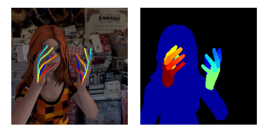

# Learning to Estimate 3D Hand Pose from Single RGB Images

Clova AI Intern Interview Assignment

Implementation of [Learning to Estimate 3D Hand Pose from Single RGB Images][paper1] by tensorflow.

## Recommended Python Packages Version

* python : 3.5.6
* tensorflow : 1.10.0
* numpy : 1.18.5
* matplotlib : 3.0.0
* opencv : 3.4.1


## Data Set


### [Rendered Handpose Dataset](https://lmb.informatik.uni-freiburg.de/resources/datasets/RenderedHandposeDataset.en.html)

This dataset provides 41258 training and 2728 testing samples. Each sample provides:
- RGB image (320x320 pixels)
- Depth map (320x320 pixels); See examples for how to convert the provided RGB
- Segmentation masks (320x320 pixels) for the following classes: background, person, three classes for each finger and one for each palm
- 21 Keypoints for each hand with their uv coordinates in the image frame, xyz coordinates in the world frame and an indicator if they are visible
- Intrinsic Camera Matrix K
It was created with freely available character from www.mixamo.com and rendered with www.blender.org
For more details see the aforementioned paper.

### Keypoints available:
* 0: left wrist
* 1-4: left thumb(tip to palm)
* 5-8: left index, ...17-20: left pinky
* 21: right wrist
* 22-25: right thumb, ..., 38-41: right pinky

### Segmentation masks available:
* 0: background
* 1: person, 
* 2-4: left thumb(tip to palm)
* 5-7: left index, ..., 14-16: left pinky, 17: palm
* 18-20: right thumb, ..., 33: right palm

### Load data

* Download [data](https://lmb.informatik.uni-freiburg.de/resources/datasets/RenderedHandposeDataset.en.html) and set 'path_to_db' at loader.py to where the dataset is located on your machine

* Optionally modify data_set variable to training or evaluation
``` python
# loader.py
path_to_db = './RHD_published_v2/'
tloader = loader.Data('training')
eloader = loader.Data('evaluation')
```
* You can open data sample by sample_id
``` python
# loader.py
sample_id = 3
image, mask, depth = tloader.load_id(sample_id)
anno = tloader.anno_all[sample_id]
``` 

## Training Network
The model saved automatically when it is initialized. If there is a same model ID(i.e. name) on it's directory, the remain one can be removed. if you want to load model, you need to use diffrent name for model

The model need configuration infro to initialize.

    <Configuration info>
    ID : Model ID
    n_iter : Total number of iterations
    n_prt : Loss print cycle
    input_h : Image height
    input_w : Image width
    input_ch : Image channel (e.g. RGB)
    n_output : Dimension of output
    n_batch : Size of batch
    n_save : Model save cycle
    n_history : Train/Test loss save cycle
    LR : Learning rate
    random_crop : Random crop by 256x256 when training HandSegNet
    training : True or False, it will determine dropout condition
    
    <Configuration example>
    config = {
        'ID' : 'test_handseg',
        'n_iter' : 20000,
        'n_prt' : 100,
        'input_h' : 320,
        'input_w' : 320,
        'input_ch' : 3,
        'n_output' : 10,
        'n_batch' : 8,
        'n_save' : 1000,
        'n_history' : 50,
        'LR' : 1e-5,
        'random_crop' : True,
        'training' : True,
    }
    
### Example of training network
``` python
import loader
import model

training_loader = loader.Data('training')

config = {
    'ID' : 'handseg_01',
    'n_iter' : 20000,
    'n_prt' : 100,
    'input_h' : 320,
    'input_w' : 320,
    'input_ch' : 3,
    'n_output' : 10,
    'n_batch' : 8,
    'n_save' : 1000,
    'n_history' : 50,
    'LR' : 1e-5,
    'random_crop' : True,
    'training' : True,
}

SegNet = model.Hand3DPoseNet(config=config)
SegNet.train_HadSegNet(training_loader)
```

## Loading Network

You can simply load the model by checkpoint

### Example of loading network

``` python
config_test = {
    'ID' : 'test_model',
    'n_iter' : 20000,
    'n_prt' : 100,
    'input_h' : 320,
    'input_w' : 320,
    'input_ch' : 3,
    'n_output' : 10,
    'n_batch' : 8,
    'n_save' : 1000,
    'n_history' : 50,
    'LR' : 1e-5,
    'random_crop' : False,
    'training' : False,
}
SegNet_test = model.Hand3DPoseNet(config=config_test)
SegNet_test.load(checkpoint) # (e.g) checkpoint = './handseg_01/checkpoint/handseg_01_20000'
```

### Example output of HandSegNet


## Issues

[paper1]: https://arxiv.org/pdf/1705.01389.pdf